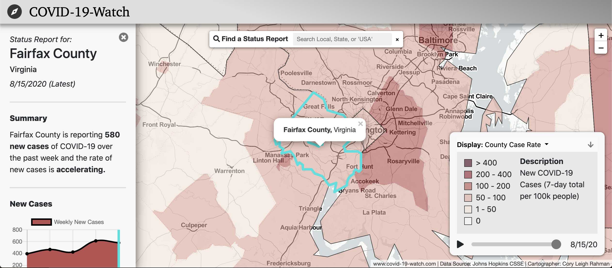
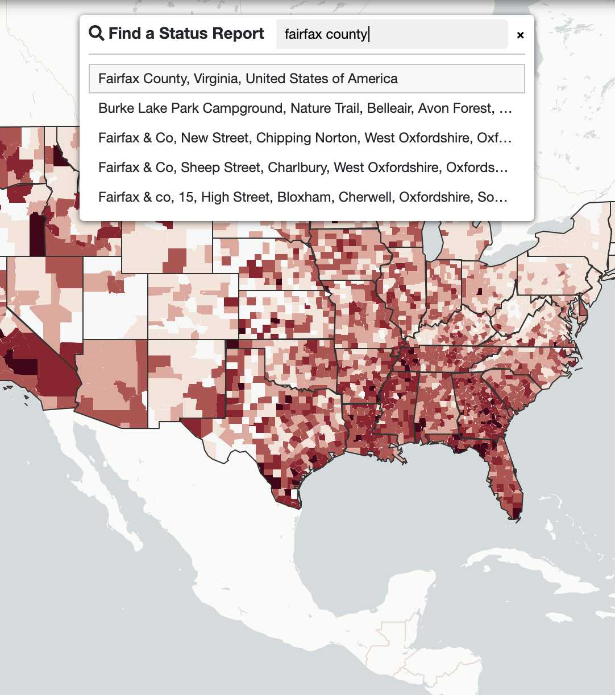
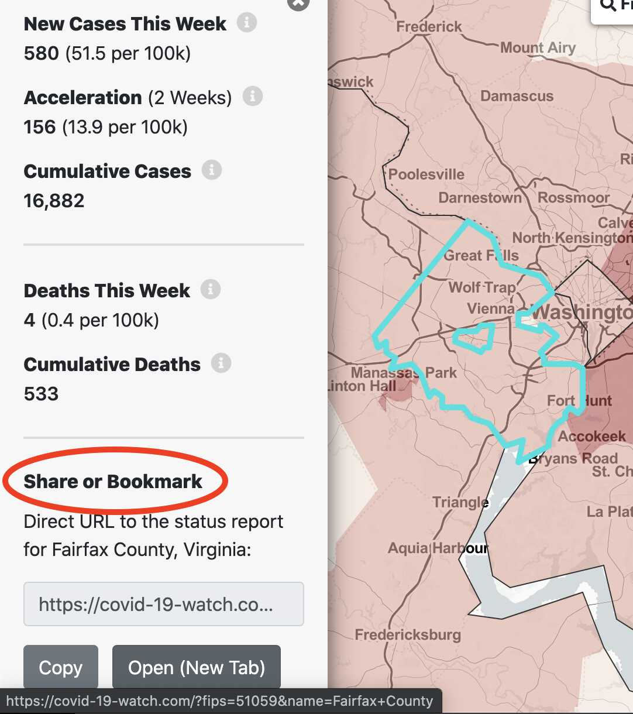
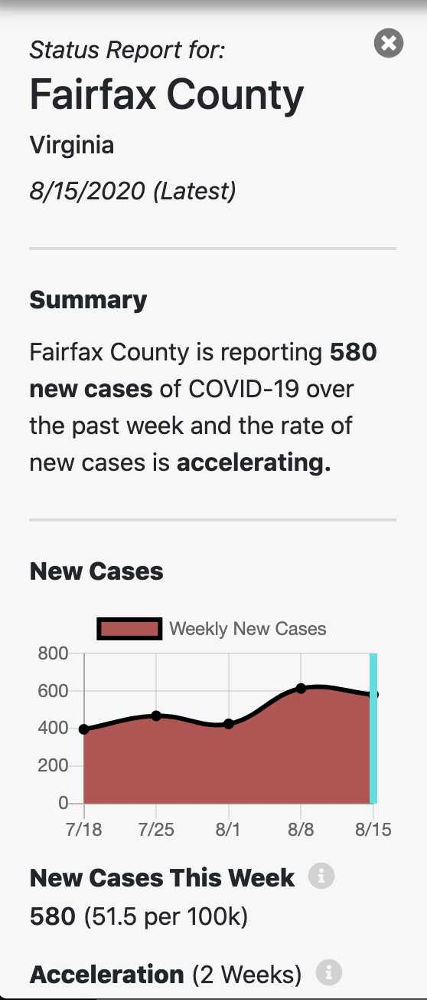
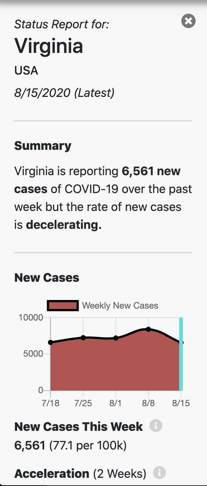
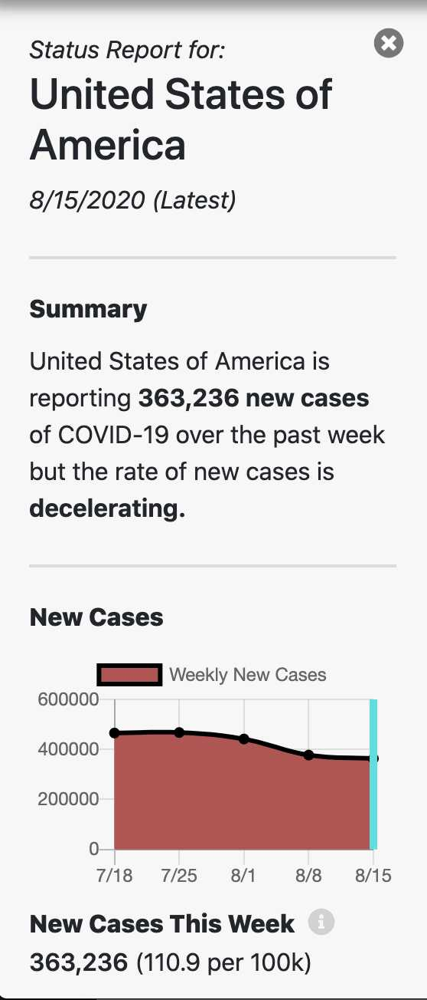
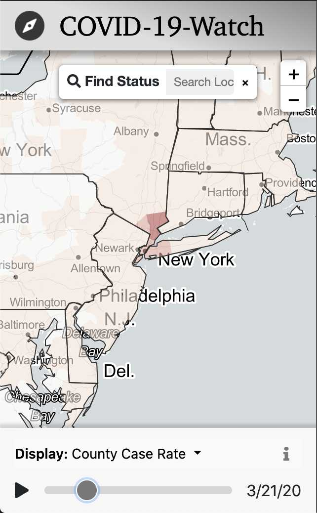
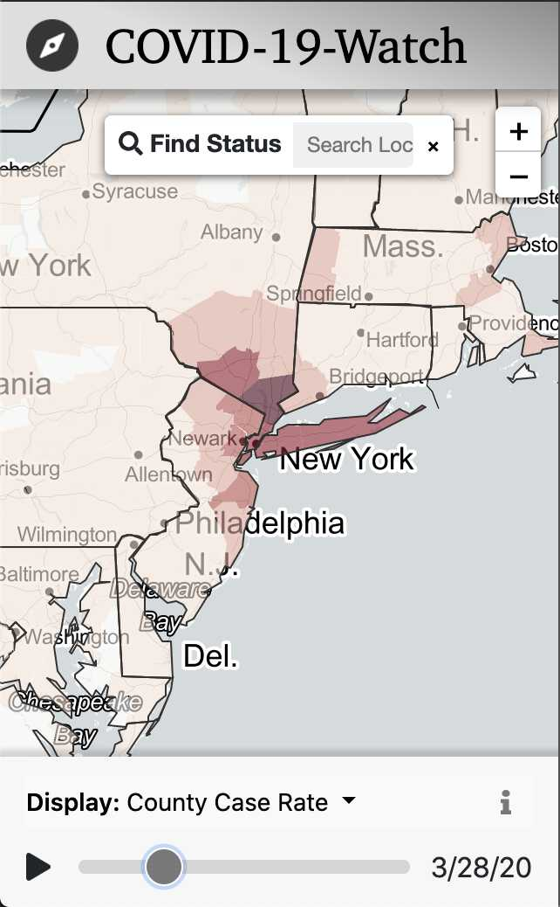
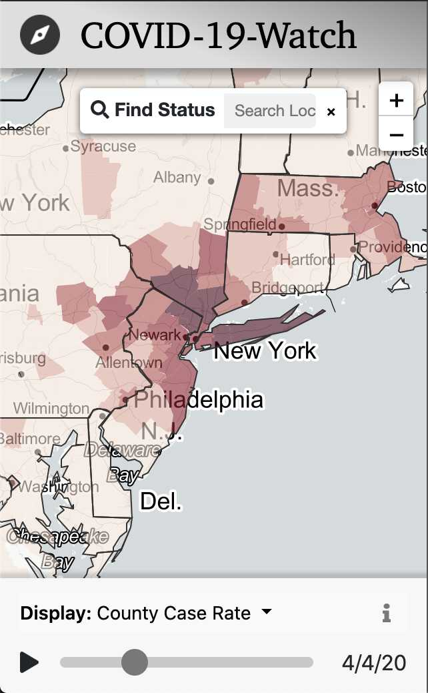
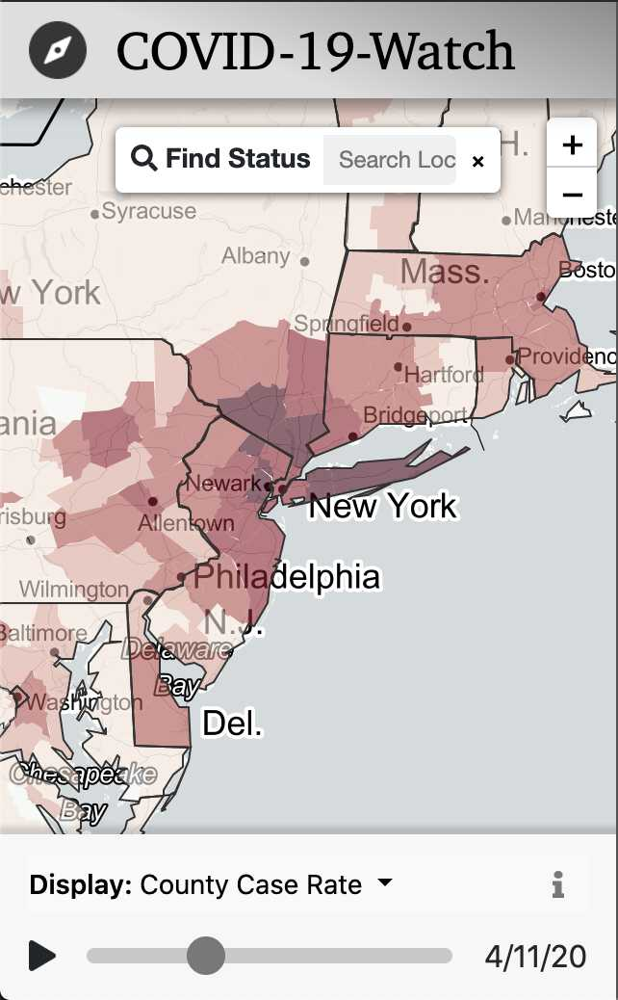

# Executive Summary: COVID-19-Watch

Cory Leigh Rahman • 2020-08-16 • Practicum in GIS Development

Master's in GIS and Web Map Programming, University of Wisconsin-Madison

**Table of Contents**

- [Executive Summary: COVID-19-Watch](#executive-summary-covid-19-watch)
  - [Purpose](#purpose)
  - [Solution](#solution)
    - [How To: Quickly find and share local COVID-19 trends](#how-to-quickly-find-and-share-local-covid-19-trends)
    - [How To: Explore local and national trends](#how-to-explore-local-and-national-trends)
    - [How To: Explore how COVID-19 has progressed over time](#how-to-explore-how-covid-19-has-progressed-over-time)
  - [Understanding the Data](#understanding-the-data)
    - [Data Flow:](#data-flow)
  - [Acknowledgements & Technologies Used](#acknowledgements--technologies-used)

## Purpose

This project is meant to encourage our fellow U.S. Citizens to take COVID-19 more seriously by enabling direct access to local, easy-to-understand COVID-19 trends.

Many people see a statistic on the national News such as "there have now been 5 million cases in the US" and find it hard to personally connect to that number. It's hard to conceptualize. However, when someone sees "*Your County* is reporting 500 new cases of COVID-19 in the past week", that's a lot easier to connect to and comprehend.

## Solution

The ***COVID-19-Watch*** application was developed and is available at [www.covid-19-watch.com](https://www.covid-19-watch.com) (and [covid-19-watch.herokuapp.com](http://covid-19-watch.herokuapp.com) for easier access behind firewalls). The app is free and open source, anyone can [view the Source Code on GitHub](https://github.com/CoryLR/COVID-19-Trend-Map).

|  |  |
| ---------------------------------------------------- | ---------------------------------------------------------- |
| COVID-19-Watch Home Screen                           | Local Status Report                                        |

This app allows the public to:

1. Quickly find and share local COVID-19 trends
2. Explore local and national trends
3. Explore how COVID-19 has progressed over time

### How To: Quickly find and share local COVID-19 trends

- Search for your town or city to get a localized Status Report
- Send a direct link to any particular Status Report

|  |  |  |
| ----------------------------------------------------------------------- | ---------------------------------------------------------- | ------------------------------------------------------------------------ |
| Search for a Local Status Report                                        | View Status Report                                        | Share Direct URL to Status Report                                        |

### How To: Explore local and national trends

- Examine the change in colors in the map
- View neighboring, State and National Status Reports

|                        |                          |                                       |
| -------------------------------------------------------------------------------- | ---------------------------------------------------------------------------- | ----------------------------------------------------------------------------------- |
| Fairfax County had 51.5 cases per 100k in the week leading up to August 16, 2020 | Virginia had 77.1 cases per 100k, a slightly higher rate than Fairfax County | The County and State were both beating the national average of 110.9 cases per 100k |

### How To: Explore how COVID-19 has progressed over time

- Use the time-slider to step the entire app back in time
- Use the Play button to watch change-over-time in the map and open Status Report

|  |  |  |  |
| ------------------------------------------------------- | ------------------------------------------------------- | ------------------------------------------------------ | ------------------------------------------------------- |
| March 21, 2020                                          | March 28, 2020                                          | April 4, 2020                                          | April 11, 2020                                          |

## Understanding the Data

All information is calculated from raw COVID-19 case and death data provided by [Johns Hopkins University Center for Systems Science and Engineering (JHU CSSE)](https://systems.jhu.edu/) (Direct link to the raw data source: [https://github.com/CSSEGISandData/COVID-19](https://github.com/CSSEGISandData/COVID-19)). This Johns Hopkins dataset is highly regarded as one of the best sources of COVID-19 data (Source: [*COVID-19 deaths and cases: how do sources compare?*, Our World in Data](https://ourworldindata.org/covid-sources-comparison)).

### Data Flow:

1. Raw COVID-19 data are automatically scraped from Johns Hopkins every morning around 3am by **Diego the Data Broker**, a web robot developed to support COVID-19-Watch.
2. For every county, every state, the nation, and for every week since the data begins, Diego calculates and records:
   - Cumulative count of COVID-19 cases (used to calculate other case stats)
   - Case rate (7-day average of new COVID-19 cases)
   - Case rate, population-normalized (7-day average of new COVID-19 cases per 100,000 people)
   - Acceleration (Change in 7-day average of new COVID-19 cases from 2 weeks prior)
   - Acceleration, population-normalized (Change in 7-day average of new COVID-19 cases from 2 weeks prior per 100,000 people)
   - Recovery streak (Number of weeks since the last reported case of COVID-19)
   - Cumulative count of COVID-19 deaths (used to calculate other deaths stats)
   - Death rate (7-day average of new COVID-19 deaths)
   - Death rate, population-normalized (7-day average of new COVID-19 deaths per 100,000 people)
   <!-- - Death acceleration (Change in 7-day average of new COVID-19 deaths from 2 weeks prior) -->
   <!-- - Death acceleration, normalized (Change in 7-day average of new COVID-19 deaths from 2 weeks prior per 100,000 people) -->
3. This data is added to a Data Package alongside county, state, and national GeoJSON map files and added to the database.
4. When a member of the public accesses the app online, Diego takes the morning's latest Data Package and gives it to the app for display in the map and Status Reports.

## Acknowledgements & Technologies Used

- [University of Wisconsin Madison Master's Program in GIS and Web Map Programming](https://geography.wisc.edu/gis/onlinemasters/) for lessons, guidance, and peer reviews for the application
- [Johns Hopkins University Center for Systems Science and Engineering (JHU CSSE)](https://systems.jhu.edu/) for doing the difficult job of continuously collecting and publishing COVID-19 data
- [Esri Living Atlas](https://livingatlas.arcgis.com/en/) for population numbers and county, state, and national map data
- [OpenStreetMap](https://www.openstreetmap.org/) for location search capabilities
- [Leaflet](https://leafletjs.com) for web mapping capabilities
- [Angular](https://angular.io) for web framework capabilities
- [Node](https://nodejs.org/) / [Express](https://expressjs.com) for web server capabilities
- [PostgreSQL](https://www.postgresql.org) database capabilities
- [Heroku](https://www.heroku.com) for development operations & hosting capabilities
