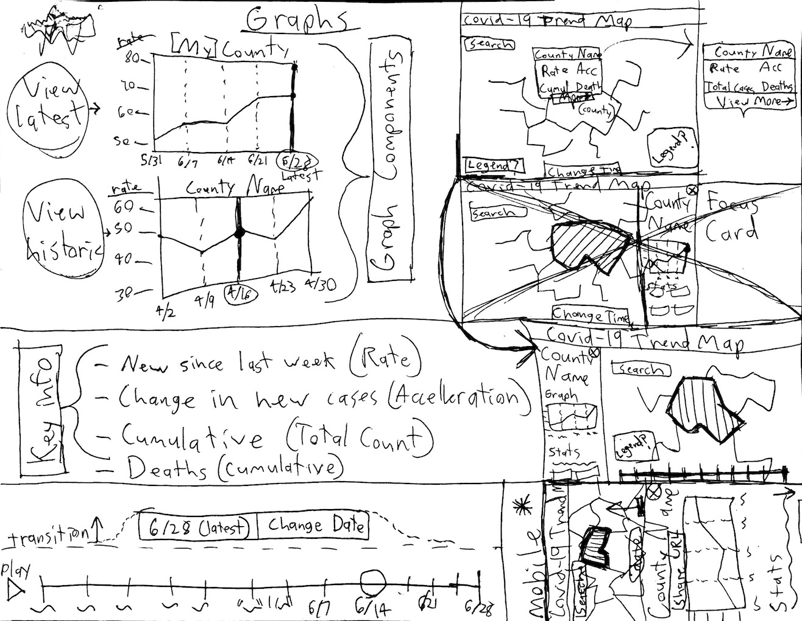

# Status Report 1 - COVID-19 Trend Map

Cory Leigh Rahman • 2020-06-28 • GEOG 778: Practicum in GIS Development

Master's in GIS and Web Map Programming, University of Wisconsin-Madison

<!-- Instructions
1. Identify the need for skills and strategies in integrating the concepts and the solutions;
2. Reflect the processes/steps in solving the problems in the project;
3. Report any challenges and possible solutions even if it fails;
4. Make a plan for the next iteration.
-->

## Introduction

This is the first of four status reports on the development progress of the COVID-19 Trend Map application ([Project Plan](https://github.com/CoryLR/COVID-19-Trend-Map/blob/main/dev-journal/Project-Plan-Geog778-2020-06-14-Cory-Leigh-Rahman.md)). The project is **on schedule** because the following tasks have been completed.

- **Week 1** (6/15 - 6/21)
  - [x] Initialize GitHub Repository
  - [x] Architect source code for the server and application
  - [x] Initialize Heroku Project and GitHub deployment integration
  - [x] [Deliverable] Plan, record, post, and deliver elevator pitch

- **Week 2** (6/22 - 6/28)
  - [x] Write server code to pull, aggregate, and geo-enable COVID-19 data from Johns Hopkins for use in the front-end
  - [x] Brainstorm & create wireframe mock-ups using responsive design best-practices to account for varying screen sizes
  - [x] [Deliverable] Write and deliver Status Report #1

## Skills & Strategies

A variety of data science, programming, and design skills were necessary to complete the tasks from the past 2 weeks:

- **Data Science and programming** skills were required to create [Diego the Data Broker](https://github.com/CoryLR/COVID-19-Trend-Map/blob/main/server/Diego-DataBroker.bot.js). Diego is a web robot who lives in the application's server. He has been designed to collect county-level COVID-19 data from Johns Hopkins University and calculate the rate and acceleration of COVID-19 cases for all 3000+ counties across 20+ time-stops (growing every week). Diego then population-normalizes this data per county, merges it with a county GeoJSON map layer, and delivers all this data to the front-end application upon user request. Right now, Diego runs his analysis every time data is requested of him, but in the future he will only run the analysis once per day and store his results in a database for easy access.
- **Programming and development operations (Dev Ops)** skills were required to initialize the GitHub source code repository, architect the source code for both the server and application, and initializing the deployment platform on Heroku.
- **Design** skills, specifically **user interface and user experience (UI/UX) design**, were required to plan the application and design wire-frame mock-ups using responsive design best-practices to account for varying screen sizes.

|  |  |
| ------------------------------------------ | ------------------------------------------- |
| UI/UX Planning                             | Wireframes                                  |

## Processes & Steps

- Diego's Data Workflow
  - When the server sees a `/getData` request from the front-end it triggers Diego's `getLatestDataAndMetrics` function which starts the process of sending an HTTP request to JHU CSSE's COVID-19 GitHub Repository. This request reads in a CSV file of data to process and join with the U.S. county GeoJSON file stored in the server.
  - The U.S. county GeoJSON file Diego uses was created and minified by using the following steps:
    1. Pull Esri's "USA Counties (Generalized)" from the Living Atlas into QGIS
    2. Fix the layer's geometry by importing & exporting from GRASS via QGIS, then running QGIS's "Fix geometries" tool
    3. Dissolve based on FIPS to turn the resulting Polygon layer back into a MultiPolygon
    4. Export as GeoJSON with only Name, FIPS, and POPULATION; set coordinate precision to 2
- Code Architecture & DevOps
  - The front-end was initialized with Angular 9 using the [Angular CLI](https://cli.angular.io) and the standard `ng new` initialization process. The code was committed to its own [GitHub Repo](https://github.com/CoryLR/COVID-19-Trend-Map). The server code was included in the same folder, initializing an Express server with the `index.js` file. In addition to the standard `main` code branch, a `live` code branch was created to trigger builds on Heroku.
- Design process
  - The design process started by focusing on the purpose of informing the public about U.S. COVID-19 trends. Then two brainstorming questions were asked: 1) What elements will be visible? 2) What are some common workflows? Once these questions were answered with the purpose, rough wireframes were drawn to visualize and conceptualize application functionality.

## Challenges & Contingencies

The biggest challenge right now is time. Even sticking to the schedule I've made will put me slightly more behind than I'd like to be. I'd really like to have most of my features functional before the Beta #1 due date so that the Beta testers have a more authentic experience. However, it is understood that not all functionality is expected with Beta #1. My contingency plan is therefore to come up with placeholders or mock-graphics to show where elements will be.

## Next Steps

As stated in the [Project Plan](https://github.com/CoryLR/COVID-19-Trend-Map/blob/main/dev-journal/Project-Plan-Geog778-2020-06-14-Cory-Leigh-Rahman.md), the following are my goals for the next 2 weeks. However, if possible, I'd like to advance the "Build functionality" task into Week 3 to have more content available for Beta #1.

- **Week 3** (6/29 - 7/5)
  - [ ] Write front-end code to display COVID-19 data using a time-slider and animation controls
  - [ ] Create non-functioning UI for location search, share sheet / URL scheme, and maybe chart graphics
  - [ ] Publish live Beta #1
  - [ ] [Deliverable] Write and deliver user-testing guide utilizing Live Beta #1

- **Week 4** (7/6 - 7/12)
  - [ ] Solicit feedback on the live Beta #1 from mentors and peers
  - [ ] Build functionality for location search, share sheet / URL scheme, and chart graphics
  - [ ] Update application to address feedback from Beta #1
  - [ ] [Deliverable] Write and deliver Status Report #2
